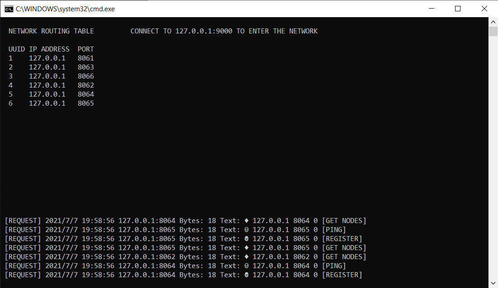
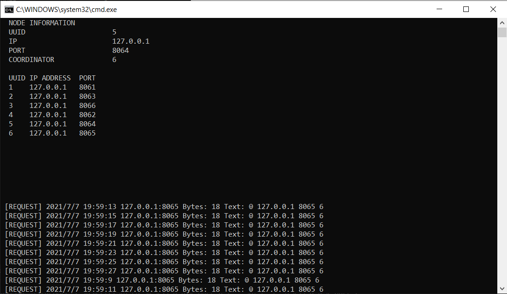

## Bully Algorithm

## Run the application
| Executable | Args | Description |
| :---: | :---: | :---: |
| BullyAlgoRoutingServer.exe |  | `runs the routing server` |
| BullyAlgoNode.exe | `port number` | `spawns a new node` |
```
Steps:
    1. Double-click `run.cmd` to create a routing server
    2. Double-click `connect.cmd` to spawn nodes
```

## Simulation
```
- To create more nodes run `BullyAlgoNode.exe <port number>`
- To simulate a crash just close the window of the node
```

## Method used to connect nodes
```
I am using basic tcp sockets to make sure data is reliably reaching each node.
I am assuming this could also be ran from different devices not necessarily local.
```

## The Logic
```
Steps to enter the network and connecting to other nodes:
    1. Run a server with a given port [Assuming ip is always localhost]
    2. If server ran successfully we proceed if not we abort
        - this means the port is busy
        - pick another one or wait until it is free
    3. Ping the routing server and make sure it's alive
        - if routing server is alive proceed to next step
        - you need to keep the routing server alive to allow new nodes in the network
    4. Connect to the routing server and register yourself
        - if the given ip and port have not been registered before
            - if the routing server didn't hit maximum usage limit
                - the routing server registers them and passes a new unique uuid
        - else the routing server passes the old unique id for the ip and port
    5. Request nodes table from the routing server
    6. Loop on all nodes and display live updates of connected nodes and coordinator
    7. If coordinator's last sent message was older than 4 seconds
        - set the node coordinator to itself
        - loop for each node in the network
            - send a call for re-election message with the node as a candidate
    8. Every node keeps listening for incoming requests
        - if the request is a ping 
            - check if the sender is actually the coordinator
                - if valid then mark this as the last ping (timestamp)
        - if the request is a re-election
            - check if the sender uuid is greater than the node's uuid
                - if true then make the sender the coordinator for that node
                - if not call for re-election and pass the node as the candidate
```

## Problems (need improvement)
```
The current mechanism used is not accurate when it comes to the time taken for the
coordinator to ping all nodes in the network.

When the number of nodes is very large the time taken for the coordinator to ping
all the nodes will probably take too long to the extent that some nodes will assume
that the coordinator is out of service while actually the coordinator is alive but
too busy sending pings to a lot of other nodes in the network.

This requires the timeout to be increased in order for the coordinator to have enough
time to ping all the nodes in the network.
```

## Notes
```
Once a node got created and got the table of nodes from the routing server
it never contacts the routing server again.
New coming nodes in the network send call for re-election.
This is when old nodes catch the request, which is sent from an unknown node to them.
So they assume that this is a new node and they insert the node in their local tables.
```

### Routing Server
```
Is the table that tracks all incoming nodes in the network.
If the routing server dies the network will still work perfectly fine.
It's only important to allow new nodes to enter the network.
Has:
    - Unique identifier counter (incremented when needed)
    - Set of all nodes (ip, port, uuid) in the network
```

### Node
```
Is a lightweight representation of single node in the network
Has:
    - ip
    - port
    - uuid
```

### Knobs
```
The routing server:
    - Default ip
        - file          : include/BullyAlgo/Router.h
        - line          : 23
        - var           : ROUTING_SERVER_IP
        - default value : "127.0.0.1"
    - Default port
        - file          : include/BullyAlgo/Router.h
        - line          : 24
        - var           : ROUTING_SERVER_PORT
        - default value : "9000"
    - Maximum number of nodes allowed in the network
        - file          : include/BullyAlgo/Router.h
        - line          : 26
        - var           : MAX_ROUTING_SERVER_NODES
        - default value : 60
```

## Screenshots
Routing Server Window             |  Node Window
:-------------------------:|:-------------------------:
  |  